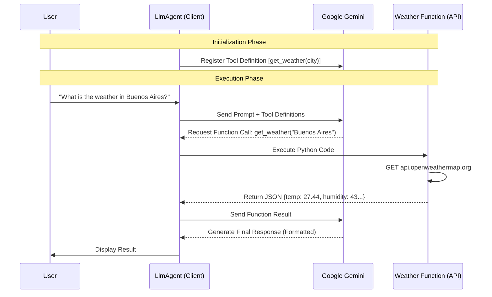

```markdown
# Weather Bot Agent (Google ADK)

This project demonstrates a robust implementation of a **Sequential Agent** using the Google ADK framework. Unlike simple scripts, this project utilizes **Function Calling** to bridge the gap between Large Language Models (Gemini) and real-world data (OpenWeatherMap), decoupled via strict configuration management.

## 🧠 Logic & Visualization

To understand this architecture, we use the **"Brain & Tool Belt" Analogy**:

- **The Brain (LLM/Gemini):** The cognitive engine that understands natural language but lacks real-time knowledge.
- **The Tool Belt (Tools):** Specific Python functions wrapped as `FunctionTools`.
    1.  **Weather Tool (`get_weather`):** A rigid interface that validates inputs and fetches live data.
- **The Agent (Orchestrator):** The `LlmAgent` that listens to the user, decides which tool to pull from the belt, executes it, and formats the result according to strict instructions.
```

### Architecture Diagram

The Agent acts as a middleware, translating user intent into API calls and raw JSON into human-readable Russian text.



## 📂 Project Structure

The project follows a modular structure separating the tool logic, configuration, and agent definition.

```text
.
├── Makefile                        # Automation: lint, test, run, clean
├── pyproject.toml                  # Dependencies (google-adk, pydantic)
├── README.md                       # Documentation
├── src
│   └── sequential_agents
│       ├── agent.py                # AGENT: The LlmAgent configuration & Prompt
│       ├── config.py               # CONFIG: Pydantic settings & validation
│       └── tools
│           └── weather.py          # TOOL: OpenWeatherMap API implementation
└── tests                           # Unit Tests

```

## ⚙️ Setup & Installation

1. **Prerequisites**: Python 3.13+, Poetry installed.
2. **Environment**:
Use `poetry` to install dependencies:
```bash
poetry install

```


3. **Configuration**:
Create a `.env` file in the root directory. This project uses `pydantic-settings` with double underscores (`__`) for nesting.
```ini
# --- Google GenAI Settings ---
GOOGLE__GENAI_USE_VERTEXAI=false
GOOGLE__API_KEY=your_google_api_key_here
GOOGLE__TEST_MODEL=gemini-2.5-flash-lite

# --- Weather Provider Settings ---
WEATHER__API_KEY=your_openweathermap_api_key_here

```


## 🚀 Usage

This command starts the Agent using the entry point defined in the Makefile.

```bash
make run

```

### Expected Output

Observe the system logs. The agent initializes, connects to the model, and creates the format strictly as requested in the system prompt.

```text
INFO:sequential_agents.agent:Starting in API Key mode with model gemini-2.5-flash-lite
USER: Какая погода в Буэнос-Айресе?

AGENT:
**Буэнос-Айрес**

🌡️ Температура: 27.44°C

☀️ Погода: Ясно

💧 Влажность: 43%

🎈 Давление: 1008 гПа

🌬️ Ветер: 5.66 м/с

🌥️ Облачность: 0%

```

## 💻 Code Highlights

### 1. The Tool Logic (`weather.py`)

Provides the raw capability to fetch data. Note the use of `Pydantic` models for strict typing of the return data.

```python
class WeatherType(BaseModel):
    city: str = Field(..., description="The city name.")
    temperature: float = Field(..., description="The current temperature...")
    # ... other fields

def get_weather(city: str) -> Dict[str, Any]:
    """The current weather in the city."""
    # ... requests logic ...
    return weather_obj.model_dump()

```

### 2. The Configuration (`config.py`)

Uses `pydantic-settings` to manage secrets securely, supporting both VertexAI and API Key modes via environment variables.

```python
class GoogleModel(BaseModel):
    genai_use_vertexai: bool
    vertexai_model: str = Field(default="gemini-3-pro-preview")
    api_key: SecretStr
    # ...

class Settings(BaseSettings):
    model_config = SettingsConfigDict(env_nested_delimiter="__")
    google: GoogleModel
    weather: WeatherModel

```

### 3. The Agent Definition (`agent.py`)

The Agent integrates the model and the tool. The strict formatting instructions ensure the output is always consistent.

```python
# 1. Initialize Tool
weather = FunctionTool(get_weather)

# 2. Define Agent
root_agent = LlmAgent(
    name="Weather_bot",
    model=my_model,
    instruction="""
    ROLE: You are a helpful weather bot.
    LANGUAGE: Output STRICTLY in Russian.
    FORMATTING RULES (CRITICAL):
    1. City name must be **Bold** on the first line.
    2. You MUST use a DOUBLE NEW LINE...
    """,
    tools=[weather] # <--- Tool injection
)

```

## 🏆 Key Takeaways

* **Strict Formatting:** By embedding strict formatting rules in the `instruction`, we force the LLM to act as a UI renderer.
* **Dual Mode Support:** The code dynamically switches between `VertexAI` and `AI Studio` (API Key) based on the config.
* **Type Safety:** Using `Pydantic` for both settings and tool data structures ensures runtime safety and clear error messages.
