```markdown
# Sequential Travel & Weather Agent (Google ADK)

This project demonstrates an advanced architectural pattern using the **Sequential Agent** model within the Google ADK framework. It orchestrates multiple specialized sub-agents to solve complex, multi-step user requests by chaining inputs and outputs.

## 🧠 Logic & Visualization

To understand this architecture, we use the **"Assembly Line" Analogy**:

- **The Coordinator (Sequential Agent):** The main manager (`trip_agent`) that receives the task and passes it down the line.
- **The Specialists (Sub-Agents):**
    1.  **Weather Bot:** Specialist in meteorological data. Checks the city and current conditions using `OpenWeatherMap`.
    2.  **Travel Guide:** Specialist in tourism. Uses AI search (Tavily) to find hotels, restaurants, and attractions based on the context.
- **The Workflow:** The output of the first agent becomes the context for the next, allowing for rich, context-aware responses.

### Architecture Diagram

The system executes agents in a strict sequence, aggregating the results into a final report.
```



```mermaid
sequenceDiagram
    participant User
    participant Root as Sequential Agent
    participant WeatherBot as Weather Sub-Agent
    participant TravelBot as Travel Sub-Agent
    participant APIs as External APIs

    User->>Root: "Plan a trip to Buenos Aires"

    Note over Root, WeatherBot: Step 1: Weather Check
    Root->>WeatherBot: Activate
    WeatherBot->>APIs: get_weather("Buenos Aires")
    APIs-->>WeatherBot: {temp: 27°C, clear sky...}
    WeatherBot-->>Root: Formatted Weather Report

    Note over Root, TravelBot: Step 2: Travel Search
    Root->>TravelBot: Activate (Context: Weather Report)
    TravelBot->>APIs: get_tavily_search("Travel guide...")
    APIs-->>TravelBot: Search Results (Hotels, Spots)
    TravelBot-->>Root: Formatted Travel Guide

    Root->>User: Final Aggregated Response

```

## 📂 Project Structure

The project has expanded to include multiple tools and updated configuration models.

```text
.
├── Makefile                        # Automation: lint, test, run, clean
├── pyproject.toml                  # Dependencies (google-adk, tavily-python)
├── README.md                       # Documentation
└── src
    └── sequential_agents
        ├── agent.py                # LOGIC: SequentialAgent & Sub-agents definition
        ├── config.py               # CONFIG: Pydantic settings for all providers
        └── tools
            ├── tavily.py           # TOOL: AI Search Engine integration
            └── weather.py          # TOOL: OpenWeatherMap integration


```

## ⚙️ Setup & Installation

1. **Prerequisites**: Python 3.13+, Poetry installed.
2. **Environment**:
Use `poetry` to install dependencies:
```bash
poetry install

```


3. **Configuration**:
Create a `.env` file in the root directory. This project uses `pydantic-settings` with double underscores (`__`) for nesting.
```ini
# --- Google GenAI Settings ---
GOOGLE__GENAI_USE_VERTEXAI=false
GOOGLE__API_KEY=your_google_api_key
# GOOGLE__CLOUD_PROJECT=your_project_id (Required if VERTEXAI=true)
# GOOGLE__CLOUD_LOCATION=us-central1 (Required if VERTEXAI=true)

# --- Tool Providers ---
WEATHER__API_KEY=your_openweathermap_api_key
TAVILY__API_KEY=tvly-your_tavily_api_key

```


## 🚀 Usage

This command starts the Agent using the entry point defined in the Makefile.

```bash
make run

```

### Expected Output

The agent provides a rich, multi-sectional report formatted strictly according to the prompts.

```text
INFO:sequential_agents.agent:Starting in API Key mode with model gemini-2.5-flash-lite
USER: Plan a trip to Buenos Aires

AGENT:
**Буэнос-Айрес**

🌡️ Температура: 27.44°C

☀️ Погода: Ясно

... (Weather Section Ends) ...

🏨 **Топ-3 Отеля:**

Alvear Palace — от $450/ночь (Роскошный стиль)

Faena Hotel — от $380/ночь (Современный дизайн)

🍽️ **Рестораны:**

Don Julio — Стейк-хаус (Топ-1 Латинской Америки)

El Preferido de Palermo — Традиционная кухня

🗽 **Достопримечательности:**

Обелиск — Символ города

Театр Колон — Оперный театр

```

## 💻 Code Highlights

### 1. Sequential Agent Composition (`agent.py`)

We compose a `SequentialAgent` from two distinct `LlmAgent` instances. The `sub_agents` list defines the execution order.

```python
root_agent = SequentialAgent(
    name="trip_agent",
    description="Fetch the weather and travel info of city",
    sub_agents=[weather_agent, travel_agent] # <--- Chained Execution
)

```

### 2. Tavily Search Tool (`tavily.py`)

We use `TavilyClient` specifically designed for LLM agents to get curated context instead of raw HTML.

```python
def get_tavily_search(city: str) -> Dict[str, Any]:
    search_result = tavily_client.search(
        query=f"Travel guide for {city}...",
        include_answer="advanced"
    )
    return search_result

```

### 3. Strict Formatting Prompts (`agent.py`)

The prompt engineering enforces a UI-like structure using standard text.

```python
instruction="""
    FORMATTING RULES (CRITICAL):
    1. City name must be **Bold** on the first line.
    2. You MUST use a DOUBLE NEW LINE (an empty line) between every parameter...
    3. Do not use bullet points...
"""

```

## 🏆 Key Takeaways

* **Sequential Chaining:** The ability to break down a complex "Trip Planning" task into atomic steps (Weather -> Places).
* **Dual-LLM Configuration:** Each sub-agent can theoretically run on a different model (e.g., Gemini for logic, Claude for writing) if configured.
* **Strict Output Control:** By embedding formatting rules in the `instruction`, we force the LLM to act as a UI renderer.
